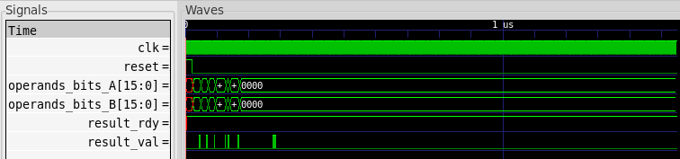
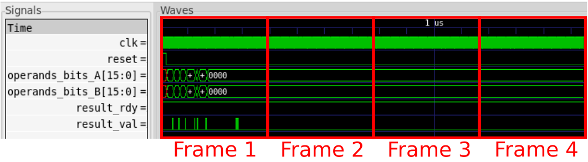
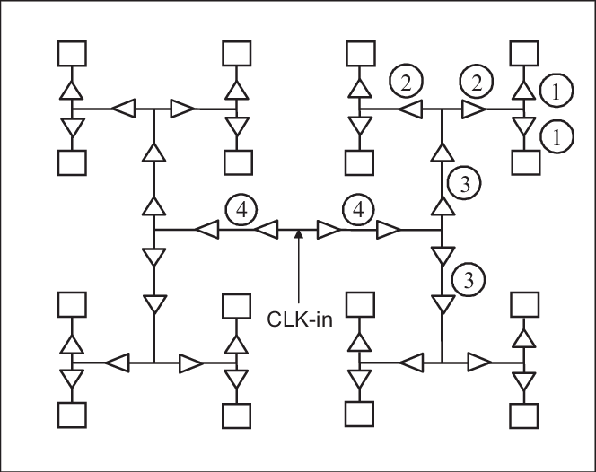

# EECS 251B Joules Tutorial - RTL Power Estimation

<p align="center">
Profs: Bora Nikolic, Sophia Shao, Vladimir Stojanovic
</p>
<p align="center">
TA: Erik Anderson
</p>
<p align="center">
Department of Electrical Engineering and Computer Science
</p>
<p align="center">
College of Engineering, University of California, Berkeley
</p>

## Overview
Cadence's
[Joules](https://www.cadence.com/en_US/home/tools/digital-design-and-signoff/power-analysis/joules-rtl-power-solution.html)
software allows for estimating an RTL design's power consumption. This kind of pre-PAR
power estimation is helpful in identifying issues early in the design lifecycle.
If the design's power is only checked at signoff, using a tool such as Voltus, then
any critical power issues won't be found until after an enormous amount of time and
energy has been put into the physical design of the block. To avoid having to re-run PAR
over and over again, designer's can use Joules to identify the issues at the RTL level
and fix them before running PAR. In addition, Joules offers a convenient way to run
power-focused design explorations. Any design exploration using post-PAR results will
require an enormous amount of computational time and resources.

## Getting Started

We will once again start with updating our environment. Pull the latest changes
to your local Chipyard repository and source the environment setup shell
script.

```
cd chipyard
git pull
source scripts/inst-env.sh
```

## Tutorial Files
This tutorial uses the same RTL and test verilog files from `vlsi/lab3` to
perform power estimation on a greatest common denominator (GCD) accelerator
block. The directory structure, showing only relevant files, for the tutorial
is shown below:

```
chipyard/vlsi
│   example-vlsi
│   inst-env.yml
│   inst-asap7.yml
│
└───lab3
│   └───src
│       │   gcdGCDUnit_rtl.v
│       │   gcdGCDUnitCtrl.v
│       │   gcdGCDUnitDpath.v
│       │   gcdTestHarness_rtl.v
│
└───joules-tutorial
    │   Makefile
    │   gcd.sdc
    │   gcd-hammer-sim-inputs.yml
    │   main.tcl
```

## Stimulus Generation
In order to generate accurate power estimates, Joules needs to know the
activity of a block's inputs. Activity can be either detailed information on
when the inputs are toggling during a specified time interval (think full
simulation history) OR the average toggle frequency per input. The stimulus is
generally created through simulation, however, Joules also supports vectorless
analysis where the user can explicitly provide the average activity of the
block's inputs. Joules' vector-driven analysis supports many different kinds of
file types. It is a safe bet that any commercial simulator will support
generation of at least one of the supported file types. The supported
file types are listed below:
- VCD (Value Change Dump)
- FSDB (Fast Signal DataBase)
- TCF (Toggle Count Format)
- SAIF (Switching Activity Interchange Format)
- SHM (Simulation History Manager)
- PHY (PHYsical probe)

The most common format is VCD which is an ASCII-based file that details how
signals within the design change during a simulation. This tutorial uses VCD
stimulus format for time-based power analysis.

To generate the VCD file the following commands should be run:

```
cd vlsi/joule-tutorial
make vpd2vcd
```

This will run the testbench `lab3/src/gcdTestHarness_rtl.v` and then convert
the generated VPD file to the desired VCD format. VPD is simply an extension of
VCD that VCS uses to create more compact waveform files. Synopsis provides a
handy `vpd2vcd` script to convert from one to the other. We could have just as
easily edited the testbench to output VCD instead of VPD. The generated VCD
file is located at `build/sim/sim-rundir/sim.vcd`.

## Running Joules
Now that we have a stimulus file we are ready to run Joules on our design.
Run the following command to run the full Joules tutorial:

```
make joules
```

This command passes `joules-tutorial/main.tcl` to the Joules executable. The
`Makefile` included in the `joules-tutorial` directory contains all of the
commands needed to create the stimulus and invoke Joules. The `Makefile` is
intentionally simple and should serve as a starting point for anyone trying to
make a more complicated Joules flow.

### Reading Stimuli
Multiple stimulus files can be read into Joules to perform a number of power
analyses on the design. We will stick with the single VCD stimulus file that we
generated earlier to keep the tutorial simple. The `read_stimulus` tcl command
is used to process stimuli within Joules. The entire simulation contained
within the VCD file is shown in the figure below:

<p align="center">
 
    <br><em>Fig. 1 - sim.vcd in GTKWave</em></br>
</p>

For time-based analysis, as opposed to a simple average analysis, the
simulation must be split into a series of smaller time units. These time units
are called "frames" and their value cannot be smaller than the precision of the
simulation. Joules calculates the average power for each frame and then
provides easy methods for plotting these results. The below figure shows an
example of partitioning our VCD stimulus into 4 contiguous frames. Obviously,
the smaller we make the frames the more insight we will get into the dynamics
of our design's power draw.

<p align="center">
 
    <br><em>Fig. 2 - sim.vcd split into 4 frames</em></br>
</p>

### Synthesis
While RTL power estimation sounds nice and easy, the truth is that the power
cannot be estimated without some physical translation of the circuit. Power
will vary dramatically from process to process with the same RTL and thus it's
imperative that Joules runs some form of technology mapping (i.e. synthesis)
before performing power analysis.

Synthesis in Joules is performed with the `syn_power` tcl command. This
performs the same steps as regular synthesis, generic mapping followed by
technology specific mapping, with a few attributes set to make it easier to
perform power analysis given a pre-synthesis stimulus file.

### Clock Tree Synthesis
Clock tree synthesis (CTS) is a crucial step in the place-and-route flow that
builds the clock networks that distribute the clocks across the design. Before
running CTS, the design's clocks are treated as "ideal" with zero skew from
endpoint to endpoint. While the network itself may consist of a small number of
gates relative to the rest of the design, the constant toggling nature of a
clock means the presence of a non-ideal clock network has a huge impact on
total power. Joules must build a simple clock tree model to include the power
dissipated by the clock networks. The below figure illustrates a common strategy
for clock distribution known as "H-tree clock distribution". This figure was
taken from [this paper](https://www.researchgate.net/publication/220337855_Clock_Distribution_Networks_with_Gradual_Signal_Transition_Time_Relaxation_for_Reduced_Power_Consumption).

<p align="center">
 
    <br><em>Fig. 3 - H-tree clock distribution network</em></br>
</p>

### Reporting
Use 4 frames
Narrow start-end window to 300ns
Decrease frame interval to 1ns
Add in

## Reference Materials
## Conclusion
Other things like clock gate insertion, logic gate insertion, DFT insertion,
CPF flow with MSVs (multiple-supply-voltages), dynamic voltage and frequency scaling, and power
shutoff modes that. Additionally, clock tree synthesis is generally one of the more complicated
steps in place-and-route and thus an accurate clock tree model will likely require more
direction than our simple model in in this example.

