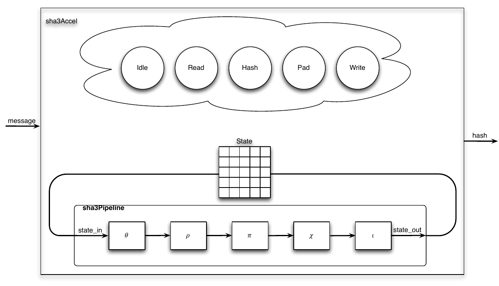
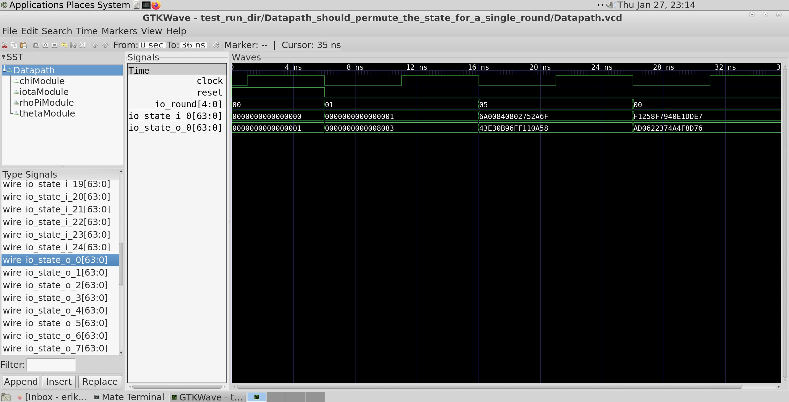

# EECS 251B Lab 2 - SHA-3 Accelerator Design in Chisel  

<p align="center">
Profs: Bora Nikolic, Sophia Shao, Vladimir Stojanovic
</p>
<p align="center">
TA: Erik Anderson
</p>
<p align="center">
Department of Electrical Engineering and Computer Science
</p>
<p align="center">
College of Engineering, University of California, Berkeley
</p>


## Overview

This lab will introduce you to Chisel project creation as well as guide you through the
design of the core elements of a SHA-3 accelerator. By the end of this lab, you should
feel comfortable creating your own custom Chisel modules, simulating them, and debugging
them using a waveform viewer.

## Chisel Project Creation

For this project we will be setting up an additional repository besides chipyard. While chipyard
is great, it is not necessarily the easiest environment to begin developing Chisel RTL. 
Thankfully, an official Chisel template repository can be found here: 
[Chisel Project Template](https://github.com/freechipsproject/chisel-template).
This repository makes it incredibly easy to create a new Chisel repo w/o worrying about setting
up all the details of building scala/Chisel code. In your private workflow 
(research, work, hobby), you should follow the instructions given in the 
README of this repository to create your own repo on github. For this lab,
the course staff has done this for you. After logging into the 
instructional machines (`eda-[1-8].eecs.berkeley.edu`) Run the following commands
to clone the Chisel project for lab 2.

```
cd /scratch/<your-username>
git clone /home/ff/eecs251b/sp22-workspace/sp22-chisel-project-template
```

Lab 1 should have already familiarized you with the sbt directory structure. If you need
refreshing visit this [page](https://www.scala-sbt.org/1.x/docs/Directories.html).
The template repo comes with a couple example Chisel source files 
(`DecoupledGCD.scala` and `GCD.scala`) as well as an example test for the `DecoupledGcd` 
module. To run this test run the following command:

```
sbt 'testOnly gcd.GCDSpec'
```

This will run the `GCDSpec` test included in `src/test/scala/gcd/GCDSpec.scala`

## SHA-3 Introduction
Before we can start building our SHA-3 accelerator, we must understand a few things
about the SHA-3 algorithm and secure hashing algorithms in general. Secure hashing 
algorithms represent a class of hashing functions that provide four attributes: 
 
1. Ease of hash computation
2. Inability to generate the message from the hash (one-way property)
3. Inability to change the message and not the hash (weakly collision free property) 
4. Inability to find two messages with the same hash (strongly collision free property) 

The National Institute of Standards and Technology (NIST) recently held a competition
for a new algorithm to be added to its set of Secure Hashing Algorithms (SHA). 
In 2012, the winner was determined to be the Keccak hashing function and a rough 
specification for SHA-3 was established. The algorithm operates on variable 
length messages with a [sponge function](https://en.wikipedia.org/wiki/Sponge_function),
and thus alternates between absorbing chunks of the message into a set of state bits
and permuting the state. The absorbing is a simple bitwise XOR while the permutation
is a more complex function composed of several operations, &#967;, &#952;, &#961;, &#960;, &#953;,
that all perform various bitwise operations, including rotations, parity calculations,
XORs, etc. The Keccak hashing function is parameterized for different sizes of state
and message chunks, but for this lab we will only support the Keccak-256 variant
with 1600 bits of state and 1088 bit message chunks. In addition, for this lab we
will ignore the variable length portion to avoid one of the most complicated
parts of Keccak: message padding. Our interface, which is discussed further below,
assumes a single chunk of message is ready to be absorbed and hashed. You can
see a block diagram of what your resulting design should look like in Figure 1.

<p align="center">
 
    <b>
    <em>Fig. 1 - Block Diagram for SHA-3</em>
    </b>
</p>

The SHA-3 standard is documented in FIPS PUB 202. The final approved specification of SHA-3
can be found [here](https://doi.org/10.6028/NIST.FIPS.202). You are encouraged to take
a quick glance at this specification as it is a good example of a standards documents. If you
are new to reading standards documents, you will probably notices that the descriptions
in the document are quite dense and may require some time to understand. This is true
of many standards documents with FIPS PUB 202 being a rather short example 
(the original IEEE 802.11 standard has over 2,700 pages with each addendum such as b, g, 
n, and ac adding more pages). Hardware designers are often responsible for implementing
different standards so learning how to read standards documents is a valuable skill.

Fortunately, you will not need to look at the FIPS PUB 202 too closely for this lab as a C
reference implementation is provided for you. The C implementation constitutes the 
software golden reference for the lab. The first step in most projects is to create a
software golden refernce that produces the behavior that is expected from the hardware
design. The results produced by the hardware design are compared against the results 
from the golden reference design to determine if the hardware design is functioning 
as expected. In addition to providing the model by which the hardware design is checked,
the golden reference can also serve as a basis for the initial hardware design.

***Q1: Why might one produce a standard document like FIPS PUB 202 instead of simply
releasing a C reference? Answer this question at a high level by looking at
the sections of FIPS PUB 202 that details the Keccak algorithm (sections 3.2-3.4).***

***Q2: What are some benefits of producing a software golden reference before beginning
the hardware design? What are some benefits of this type of verification vs. writing
explicit `poke` and `expect` style tests? What are some dangers of this type of 
verification?***

You will implement the SHA-3 design based on the C reference implementation. You 
are not encouraged to check the consistency of the C implementation with the
standards document as this will take a long time and is not the focus of the lab. 
Your implementation will be compared against the C implementation and not the 
description in FIPS PUB 202. Do not attempt to add any additional features of SHA-3
that are not included in the C implementation.

You can run the C reference version on the simplest input with the following commands:

```
cd src/main/c
make
make run
```

This will by default print out the different values of the state after each permuation
and round. Your chisel implementation should match each of these steps exactly. 
Tracing through any differences is a good way to debug the whole design, but early
simpler tests should help you avoid this tedious exercise.

## SHA-3 Datapath: Implementation and Testing Strategies

Rather than jumping in and implementing the entire SHA-3 design shown in Fig. 1, it 
would be better to start with something smaller but still testable. This should
reduce complexity and debugging time. The most logical way to begin the design 
would be to create a single cycle version that simply performs the permutation.
Even this design has multiple components that are individually testable. A good
implementation strategy would be to design each of the function blocks
(&#952;, &#961;, &#960;, &#967;, &#953;) individually and write unit-tests for 
the blocks. The Chisel source directory already has a skeleton of the code you 
will need to write, outlining how you should organize your implementation.

The given directory includes the &#952; module implemented with a test. You can
run the &#952; test by running `sbt 'testOnly sha3.ThetaSpec'`. You are
responsible for implementing the remaining modules. The tests for each function have
already been implemented for you so you can focus on using Chisel for RTL design.
Hopefully it should be obvious by now, but you can run any of the other available 
tests (they should fail because the other module are not implemented....) by 
running the following command:

```
sbt 'testOnly <PackageName>.<ClassName>'
```

You can explore the `src/test/scala/sha3` directory to see the other available tests. 
Testing a design in this manner (i.e. via unit tests) should make integration easier 
and more bug free. Once you have connected the datapath together, another logical point 
to test the design arises and you should have something like Figure 2. 

<p align="center">
 
    <b>
    <em>Fig. 2 - Unit Tests Diagram for SHA-3</em>
    </b>
</p>

## SHA-3 Control: State Machines and Interfaces

With a complete and tested datapath, the next step in implementing SHA-3 is to write
something to control the datapth. For this lab, some of the more complex needs of
the SHA-3 accelerator have been abstracted away or given to you. You will be given a
section of the message that has already been read from memory and been padded
appropriately. This limits the lengths of messages your design can hash to those
smaller than 1088 bits, but makes the design significantly simpler.

With this interface you will need to implement a control state machine (skeleton located
at `src/main/scala/sha3/CtrlFSM.scala`) that can read the message data into the datapath's 
state element, perform the correct number of permutations, and finally return the resulting 
hash. The control state machine should also adhere to the ready-valid protocol for these 
signals. The state machine should keep track of whether the accelerator is busy and how 
many rounds of permutation have been done. In addition, since we are only hashing a single 
chunk at a time, the state machine is also responsible for starting each hash with the
correct absorbed state.

The final SHA-3 accelerator block (essentially just connects the combinational datapath with the 
control FSM) has been given to you and is located in `src/main/scala/sha3/Sha3Accel.scala`.
You can also find the final test in `src/test/scala/sha3/Sha3AccelSpec.scala`. 
Obviously, you will not want to run this test until you have all of your blocks 
implemented and hooked up properly. This final test is replicated in a step-by-step
fasion online at: [https://github.com/XKCP/XKCP/blob/master/tests/TestVectors/KeccakF-1600-IntermediateValues.txt](https://github.com/XKCP/XKCP/blob/master/tests/TestVectors/KeccakF-1600-IntermediateValues.txt).

## Simulating with Chisel

For this lab, Chisel's FIRRTL interpreter, [treadle](https://github.com/chipsalliance/treadle),
will be used to simulate your blocks. The backend simulator can be changed by
using a simulator backend annotation. This process was done behind the scenes
in lab 1 when you simulated your project using Synopsys VCS. You do not need to mess 
with backends other than treadle for this lab, but if you are interested in learning more
you can find details [here](https://www.chisel-lang.org/chiseltest/).

Chisel has a specific debug API for the tester consisting of peeks, pokes, and expects.
Refer to the test file `src/test/scala/gcd/GCDSpec.scala` for an example usage of this API.

## Debugging with GTKWave 

Where should you start if a design doesn't pass your test? The answer is to
debug your RTL code using gtkwave (or any decent waveform viewing tool such as DVE 
or Simvision) to generate a waveform view of signals in your design. After running 
a simulation, you should find a `*.vcd` file corresponding to your simulation in the 
`test_run_dir` directory. This file contains a record of all signals and how they 
changed over the course of the simulation. DVE can read this file and visualize the 
wave form. Notice that the design will contain many signals with the `T_` prefix which hold 
intermediate values produced by the Chisel compiler. To open gtkwave run the following 
command (make sure you are using X2GO):

```
gtkwave test_run_dir/<AutoGeneratedName>/<ModuleName>.vcd &
```

To add signals to the waveform window (see Figure 3) first select them in the
lower left Signal Display window and then drag them into the Signal Time window. I would 
recommend spending some time playing around with GTKWave to get comfortable with it.

<p align="center">
 
    <b>
    <em>Fig. 3 - GTKWave Waveform Window</em>
    </b>
</p>

## Conclusion 

Congratulations! You have now designed and debugged the core of a SHA-3 accelerator
in Chisel. There are other optimizations and additions required to actually implement
a complete accelerator, but this lab should have given you the basic tools to go forward
and build all sorts of Chisel hardware generators.

## Deliverables

You should only need to edit the following files in order to get all tests to pass:
- `src/main/scala/sha3/RhoPi.scala`
- `src/main/scala/sha3/Chi.scala`
- `src/main/scala/sha3/Iota.scala`
- `src/main/scala/sha3/Datapath.scala` 
- `src/main/scala/sha3/CtrlFSM.scala`

***Your lab 2 submission should consist of a zip file containing the following items:***  
***1. A file containing your responses to questions 1 and 2***  
***2. All scala files in `src/main/scala/sha3` directory***  
***3. All scala files in `src/test/scala/sha3`***  
***4. A screenshot of the output of the final test `sbt 'testOnly sha3.Sha3AccelSpec'`***

## Acknowledgements

This lab is an updated version of SP17 CS250's lab 1. Many people have contributed to versions
of this lab over the years. Contributors include Colin Schmidt, James Martin,
Yunsup Lee, Christopher Yarp, Brian Zimmer, Rimas Avizienis, Ben Keller, Krste Asanovic,
Christopher Batten, John Lazzaro, and John Wawrzynek.
