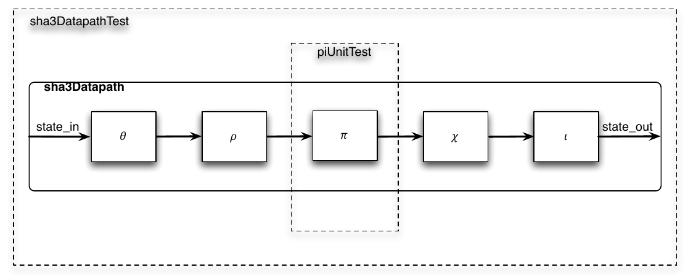

# EECS 251B Lab 2 - SHA-3 Accelerator Design in Chisel  

<p align="center">
Profs: Bora Nikolic, Sophia Shao, Vladimir Stojanovic
</p>
<p align="center">
TA: Erik Anderson
</p>
<p align="center">
Department of Electrical Engineering and Computer Science
</p>
<p align="center">
College of Engineering, University of California, Berkeley
</p>


## Overview

TODO add overview

## Chisel Project Creation

For this project we will be setting up an additional repository besides chipyard. While chipyard
is great, it is not necessarily the easiest environment to begin developing Chisel RTL. 
Thankfully, an official Chisel template repository can be found here: 
[Chisel Project Template](https://github.com/freechipsproject/chisel-template).
This repository makes it incredibly easy to create a new Chisel repo w/o worrying about setting
up all the details of building scala/Chisel code. In your private workflow 
(research, work, hobby), you should follow the instructions given in the 
README of this repository to create your own repo on github. For this lab,
the course staff has done this for you. After logging into the 
instructional machines (`eda-[1-8].eecs.berkeley.edu`) Run the following commands
to clone the Chisel project for lab 2.

```
cd /scratch/<your-username>
git clone /home/ff/eecs251b/sp22-workspace/sp22-chisel-project
```

Lab 1 should have already familiarized you with the sbt directory structure. If you need
refreshing visit this [page](https://www.scala-sbt.org/1.x/docs/Directories.html).
The template repo comes with a couple example Chisel source files 
(`DecoupledGCD.scala` and `GCD.scala`) as well as an example test for the `DecoupledGcd` 
module. To run this test run one of the following commands:

```
sbt test
```

OR

```
sbt 'testOnly gcd.GcdDecoupledTester'
```

The first command will run all tests found in our project while the second command
will run just the `GcdDecoupledTester`.

TODO TODO TODO - Force them to write the main function for simple Chisel elaboration. 
For some reason this is not included???

TODO TODO TODO - Force them to add something to GCD block?? 

## SHA-3 Introduction
Secure hashing algorithms represent a class of hashing functions that provide four
attributes: 
 
1. Ease of hash computation
2. Inability to generate the message from the hash (one-way property)
3. Inability to change the message and not the hash (weakly collision free property) 
4. Inability to find two messages with the same hash (strongly collision free property) 

The National Institute of Standards and Technology (NIST) recently held a competition
for a new algorithm to be added to its set of Secure Hashing Algorithms (SHA). 
In 2012, the winner was determined to be the Keccak hasing function and rough 
specification for SHA-3 was established. The algorithm operates on variable 
length messages with a [sponge function](https://en.wikipedia.org/wiki/Sponge_function),
and thus alternates between absorbing chunks of the message into a set of state bits
and permuting the state. The absorbing is a simple bitwise XOR while the permutation
is amore complex function composed of several operations, &#1D6D8; 

TODODOTOTTOTO add above unicode characters

that all perform various bitwise operations, including rotations, parity calculations,
XORs, etc. The Keccak hashing function is parameterized for different sizes of state
and message chunks, but for this lab we will only support the Keccak-256 variant
with 1600 bits of state and 1088 bit message chunks. In addition, for this lab we
will ignore the variable length portion to avoid one of the most complicated
parts of Keccak: message padding. Our interface, which is discussed further below,
assumes a single chunk of message is ready to be absorbed and hashed. You can
see a block diagram of what your resulting design should look like in Figure 1.

<p align="center">
 
    <b>
    <em>Fig. 1 - Block Diagram for SHA-3</em>
    </b>
</p>

The SHA-3 standard is documented in FIPS PUB 202. The final approved specification of SHA-3
can be found [here](https://doi.org/10.6028/NIST.FIPS.202). You are encouraged to take
a quick glance at this specification as it is a good example of a standards documents. If you
are new to reading standards documents, you will probably notices that the descriptions
in the document are quite dense and may require some time to understand. This is true
of many standards documents with FIPS PUB 202 being a rather short example 
(the original IEEE 802.11 standard has over 2,700 pages with each addendum such as b, g, 
n, and ac adding more pages). Hardware designers are often responsible for implementing
different standards so learning how to read standards documents is a valuable skill.

Fortunately, you will not need to look at the FIPS PUB 202 too closely for this lab as C
refernce implementation is provided for you. The C implementation constitues the 
software golden reference for the lab. The first step in most projects is to create a
software golden refernce that produces the behavior that is expected from the hardware
design. The results produced by the hardware design are compared against the results 
from the golden reference design to determine if the hardware design is functioning 
as expected. In addition to providing the model by which the hardware design is checked,
the golden reference can also serve as a basis for the initial hardware design.

***Q1: Why might one produce a standard document like FIPS PUB 202 isntead of simply
releasing a C reference? Answer this question at a high level by looking at
the sections of FIPS PUB 202 that detail the Keccak algorithm (sections 3.2-3.4).***

***Q2:What are some benefits of producing a software golden reference before beginning
the hardware design? What are some benefits of this type of verification vs. writing
explicit `poke` and `expect` style tests? What are some dangers of this type of 
verification?***

You will implement the SHA-3 design based on the C reference implementation. You 
are not encouraged to check the consistency of the C implementation with the
standards document as this will take a long time and is not the focus of the lab. 
Your implementation will be compared against the C implementation and not the 
description in FIPS PUB 202. Do not attempt to add any additional features of SHA-3
that are not included in the C implementation.

You can run the C reference version on the simplest input with the following commands:

```
cd src/main/c
make
make run
```

This will by default print out the different values of the state after each permuation
and round. Your chisel implementation should match each of these steps exactly. 
Tracing through any differences is a good way to debug the whole design, but early
simpler tests should help you avoid this tedious exercise.

## SHA-3 Datapath: Implementation and Testing Strategies

Rather than jumping in and implementing the entire SHA-3 design shown in Fig. 1, it 
would be better to start with something smaller but still testable. This should
reduce complexity and debugging time. The most logical way to begin the design 
would be to create a single cycle version that simply performs the permutation.
Even this design has multiple components that are individually testable. A good
implementation strategy would be to design each of the function blocks, CHI

TODO add in the unicode characters for different functions

individually and write unit-tests for the blocks. The Chisel source directory already
has a skeleton of the code you will need to write, outlining how you should organize
your implementation.

The given directory includes one of the modules implemented with a test. You are
responsible for implementing the remaining modules and associated tests.

You can run the given test with `test-unit-firrtli`, `test-unit-verilator`,
`test-unit-vcs` make targets. `test-unit` make target defaults to `test-unit-firrtl`.
These targets allow you to choose any of the main classes to be run so they will
continue to work as you add more tests for new modules. `test-unit-firrtl` uses
the FIRRTL interpeter; `test-unit-vcs` uses Verilog with VCS; `test-unit-verilator`
uses Verilog with Verilator. These three testing tools are discussed in more detail
below.

Testing a design in this manner should make integration easier and more bug free.
Once you have connected the datapath together another logical point to test the
design arrises and you should have something like Figure 2. In addition to the 
unit-tests from before you should now write a larger test to ensure the permutation
is happening correctly.

<p align="center">
 
    <b>
    <em>Fig. 2 - Unit Tests Diagram for SHA-3</em>
    </b>
</p>

## SHA-3 Control: State Machines and Interfaces

With a complete and tested datapath the next step in implementing SHA-3 is to write
something to control the datapth. For this lab, some of the more complex needs of
the SHA-3 accelerator have been abstracted away or given to you. You will be given a
section of the message that has already been read from memory and been padded
appropriately. This limits the lengths of messages your design can hash to those
smaller than 1088 bits, but makes the design significantly simpler.

With this interface you will need to implement a control state machine that can read
the message data into the datapath's state element, perform the correct number of
permutations, and finally return the resulting hash. The control state machine
should also adhere to the ready-valid protocol for these signals. The state machine
should keep track of whether the accelerator is busy and how many rounds of 
permutation have been done. In addition, since we are only hashing a single chunk
at a time, the state machine is also responsible for starting each hash with the
correctl absorbed state.

The main Chisel file for the whole accelerator includes a test that should test
most of the functionality. This test is replicated in a step-by-step fashion
online at: [https://github.com/gvanas/KeccakCodePackage/blob/master/TestVectors/KeccakF-1600-IntermediateValues.txt](https://github.com/gvanas/KeccakCodePackage/blob/master/TestVectors/KeccakF-1600-IntermediateValues.txt).

## SHA-3 Chisel Testing
When you are ready to test your code, there are three methods from which to choose. 
First, Chisel can run a FIRRTL interpreter which implements a cycle-accurate 
simulation of your design. To do this, run the following commands:

```
make test-firrtl
```

Second, Chisel can run your tests by generating Verilog and then compiling it using
Verilator.

```
make test-verilator
```

Third, Chisel can run your tests by generating Verilog and then using Synopsys VCS.

```
make test-vcs
```

In addtion, Chisel can also generate Verilog code that can be used as input to an
ASIC flow.

```
make verilog
```

Once you are happy that your design passes the given test you should add at least one
additional test for the design. It could be a test that checks for a different hash,
or a test that tests for a specific control sequence that seems difficult to get
right or any other case you think might not be handled correctly.

Finally, I would also like you to run two more make commands and save the output of 
these runs for submission.

This will create two files in `build` that will record the results of your simulations.

## Debugging with Chisel

To debug your Chisel design, you can use either the FIRRTL interpreter, Verilator,
or Synopsys VCS.

Chisel has a specific debug API for the tester consisting of peeks, pokes, and expects.
Refer to the test file `src/test/scala/gcd/GCDSpec.scala` for an example usage of this API.

## Verilator: Simulating your Verilog

In this lab, we will not be using Verilator directly but through Chisel. Verilator
produces a waveform file, `*.vcs`, that we will use to help us debug. Chisel
first elaborates your Chisel code into Verilog. Verilator then takes this code, cross
compiles into C++, and the C++ is then in turn compiled into native instructions
producing a binary. Chisel then interacts with this binary to test your circuit.

## Synopsys VCS: Simulating your Verilog Again

In this lab, we will also not be using VCS directly but rather using it through Chisel,
so the exact options are less important right now but for your reference info on the
options and how a more complete setup, which might be used in later labs is included
below.

VCS compiled Verilog source files into a native binary that implements a simulation
of the Verilog design. VCS can simulate both behavioral and RTL level Verilog modules.
In behavioral models, a module's functionality can be described more easily by using
higher levels of abstraction. In RTL descriptions, a module's functionality is
described ata level that can be mapped to a collection of registers and gates. Verilog
behavioral models may not be synthesizable, but they can be useful in constructing
testbenches and when simulating external devices that your design interfaces with.
An example of compiling with VCS is given below.

```
cd build-unscripted/vcs-sim-behav
vcs -full64 -PP +lint=all +v2k -timescale=1ns.10ps \
../../src/gcdGCDUnit_behav.v \
../../src/gcdTestHarness_behav.v
```

By default, VCS produces a simulator binary called simv. The `-PP` command line option
turns on support for using the VPD trace output format. The `+lint=all` argument
turns on all Verilog warnings. Since it is quite easy to write legal Verilog code
that doesn't behave as intended, you should always enable all warnings to help you
catch mistakes. For example, VCS will warn you if you try to connect two nets with
different bitwidths or don't wire up a port on a module. Always try to eliminate
all VCS compilation errors and warnings. The `+v2k` command line option tells VCS to
enable Verilog-2001 language features. Verilog allows a designer to specify how
the abstract delay units in their design map into real time units using the ``timescale`
compiler directive. To make it easy to change this parameter you will specify it on the
command line instead of in the Verilog. After these arguments you list the Verilog source
files. The `-v` flag is used to indicate which Verilog files are part of a library
(and thus should always be compiled). After running this command, you should see text
output indicating that VCS is parsing the Verilog files and compiling the modules.
Notice that VCS actually generated C++ code which is then compiled using `gcc`.
When VCS is finished there should be a `simv` executable in the build directory.

## Debugging with DVE

Where should you start if a design doesn't pass all your tests? The answer is to
debug your RTL code using the Discovery Visulation Environment (DVE) GUI to
generate a waveform view of signals in your design. The simulator has already written
a trace of the activity of every net in your design to the `Sha2Accel.vcd` file.
DVE can read this file and visualize the wave form. Notice that the design will contain
many signals with the `T_` prefix which hold intermediate values produced by the Chisel
compiler. To open DVE run the following command (make sure you are using X2GO):

```
make test-verilator
dve -full64 -vcd test_run_dir/verilator/sha3.<AutoGeneratedName>/Sha3Accel.vcd &
```

You can also use DVE to debug failing unit tests.

```
make test-verilator
dve -full64 -vcd test_run_dir/verilator/sha3.<AutoGeneratedName>/<UnitName>.vcd &
```

To add signals to the waveform window (see Figure 3) first select them in the
hierarchy window and then right click to choose `Add To Waves > New Wave View`.

<p align="center">
 
    <b>
    <em>Fig. 3 - DVE Waveform Window</em>
    </b>
</p>


## Conclusion 

Congratulations! You have now designed and debugged the core of a SHA-3 accelerator
in Chisel. There are other optimizations and additions required to actually implement
a complete accelerator, but this lab should have given you the basic tools to go forward
and build all sorts of Chisel hardware generators.

## Acknowledgements
This lab is an updated version of SP17 CS250's lab 1. Many people have contributed to versions
of this lab over the years. Contributors include Colin Schmidt, James Martin,
Yunsup Lee, Christopher Yarp, Brian Zimmer, Rimas Avizienis, Ben Keller, Krste Asanovic,
Christopher Batter, John Lazzaro, and John Wawrzynek.
