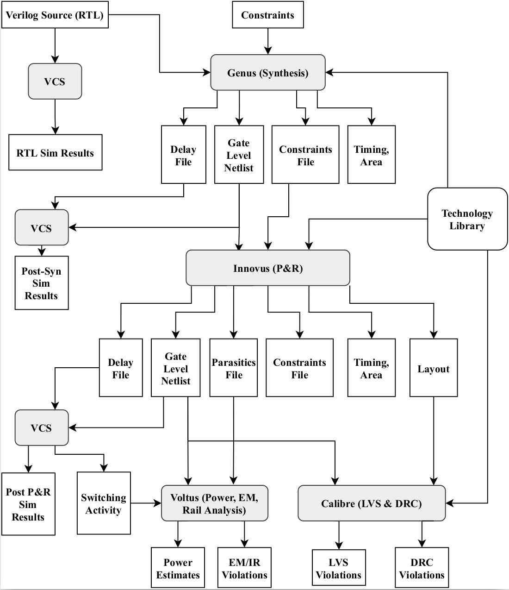
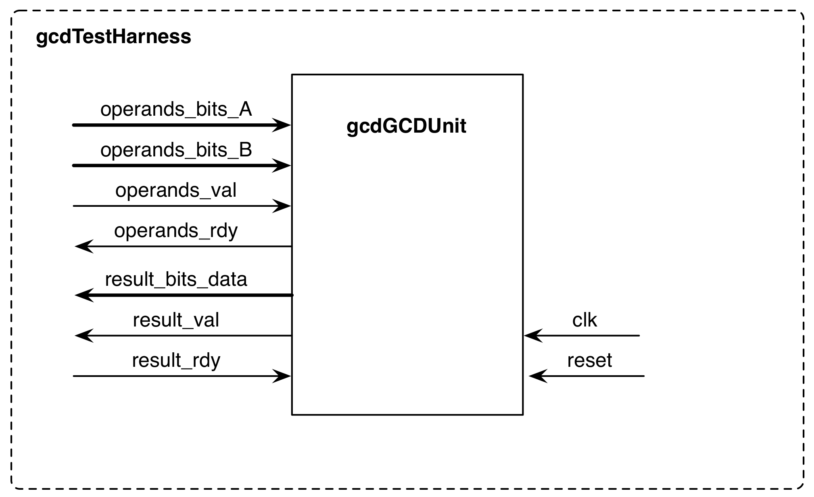
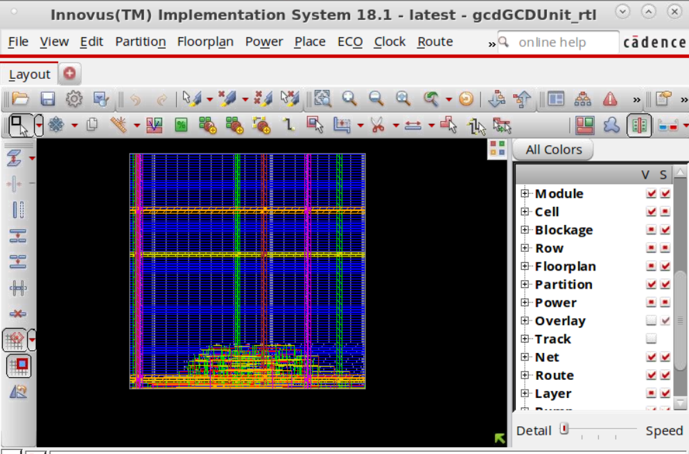
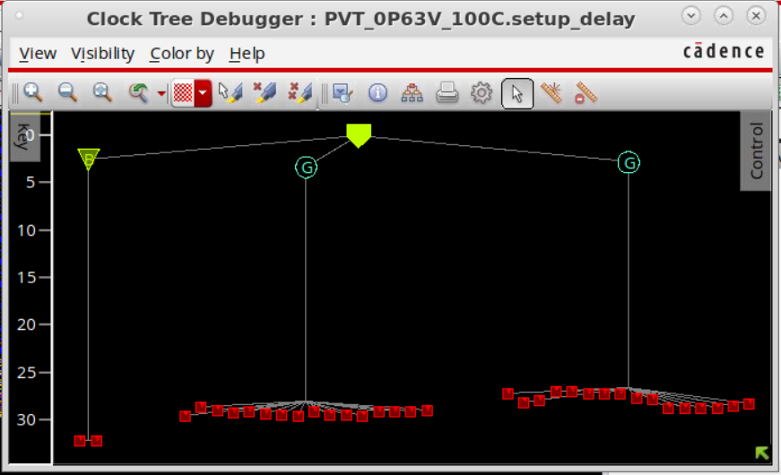

# EECS 251B Lab 3 - GCD: VLSI's Hello World  

<p align="center">
Profs: Bora Nikolic, Sophia Shao, Vladimir Stojanovic
</p>
<p align="center">
TA: Erik Anderson
</p>
<p align="center">
Department of Electrical Engineering and Computer Science
</p>
<p align="center">
College of Engineering, University of California, Berkeley
</p>

## Overview

for this tutorial, you will become familiar with the VLSI tools you will use
throughout this semester and learn how a design "flows" through this toolflow.
Specifically, given an RTL model of a simple greatest common divisor (GCD)
circuit, you will synthesize and place-and-route the design and simulate it.
We will be using Hammer, a Berkeley-developed VLSI flow framework, as our
main flow driver, but you will also get to touch the tools directly and see
how a flow is run in other cases. The main goal of this lab is to give you
an overview of a typical VLSI flow, to identify what is important for the
designer to analyze, and to introduce some more practical aspects of a VLSI
flow.

### VLSI Toolflow Introduction

Figure 1 shows an overview of a partial VLSI toolflow. In this lab, you will
use Synopsys VCS to simulate and debug your RTL design. We will be using 
Cadence tools to run through the actual VLSI flow. You will use Cadnec Genus
to synthesize the design. Synthesis is the process of transforming an RTL model
into a gate-level netlist. After obtaining a working gate-level netlist, you 
will use Cadence Innovus to place and route the design. Placement is the process
by which each standard cell is positioned on the chip, while routing involves
wiring the cells together using various metal layers. The tools will provide
feedback on the performance and area of your design after both synthesis and 
place-and-route. The results from place-and-route are more realistic but require
but require much more time to generate. Cadence Voltus can then take these 
outputs and give more accurate estimated power measurements and can help validate
your supply network. Finally, you will also use Siemens EDA (formerly Mentor 
Graphics) Calibre to do design rule checking (DRC) and layout vs. schematic (LVS)
to "signoff" your design, i.e. verify that you layout is manufacturable and
physically correct.

### Prerequisites

As you can tell from the diagram, many different tools are needed to take even a
simple design from RTL all the way to transistor-level implementation. Each tool
is immensely complicated, and many engineers in industry specialize in only one.
In order to produce a VLSI design in a single semester we will need to understand
a little about every one.

Each tools had a GUI interface, but [Tcl](https://www.tcl.tk/about/language.html) 
scripts are typically used as the primary means of driving the tool. When you 
use the GUI, the terminal window will output the textual equivalent of each click.
This gives the user an easy way to capture Tcl commands for later scripting.
In this lab, we will use Hammer which creates an abstraction on top of this which
allows the user to create generalized APIs for the physical design flow. More
information on Hammer is provided below. You will have the opportunity to
interact with the tools directly, from the GUI and the command line, as well as
through Hammer.

<p align="center">
 
    <b>
    <em>Fig. 1 - Basic VLSI Toolflow</em>
    </b>
</p>

## Getting Started

To begin the lab, update your Chipyard lab repository:

```
cd chipyard/vlsi
git pull
```

As a reminder, please note that hammer-cadence-plugins, hammer-synopsys-plugins, and
hammer-mentor-plugins repos are private. ***DO NOT PUBLISH THESE PUBLICLY***.

The `vlsi` folder now constains a new directory called `lab3`. Inside, you will see
a couple of .yml files and a `src` directory which contains the verilog source code
for the GCD design we will be pushing through the flow.

RTL:

- `src/gcdGCDUnit_rtl.v` - RTL implementation of gcdGCDUnit
- `src/gcdGCDUnitCtrl.v` - Control part of the RTL implementation
- `src/gcdGCDUnitDpath.v` - Datapath part of the RTL implementation
- `src/gcdTestHarness.v` - Test harness for the RTL model

The block diagram is shown in Figure 2. We have provided you with a test harness
that will drive the inputs and check the outputs of your design. Your module is 
named `gcdGCDUnit_rtl` and has the interface shown below.

```v
module gcdGCDUnit_rtl#( parameter W = 16 )
(

    input clk, reset,

    input   [W-1:0] operands_bits_A,    // Operand A
    input   [W-1:0] operands_bits_B,    // Operand B
    input           operands_val,       // Are operands valid?
    output          operands_rdy,       // Ready to take operands

    output  [W-1:0] result_bits_data,   // GCD
    output          result_val,         // Is the result valid?
    input           result_rdy          // Ready to take the result

);
```
<p align="center">
 
    <b>
    <em>Fig. 2 - Block diagram for GCD Test Harness</em>
    </b>
</p>

## Technology: ASAP7

The technology we will be using this semester is 
[ASAP7](https://github.com/The-OpenROAD-Project/asap7). It is an open (free
to download for academic institutions) predictive 7nm FinFET PDK developed
at Arizona State University. This means that you would not able to actually
tapeout a chip in this technology, but since it is open, you can get experience
working in a simulated advanced node without dealing with and pesky NDAs from
a real foundry.

There are some quirks with this technology. Even though the technology is 
listed as 7nm, it has a 4x scale factor so that the VLSI tools do not require
any special licenses for running at such an advanced technology node. We have
provided scripts that will automatically hack your design to scale it correctly
at the end.

The technology is extracted at `/home/ff/eecs251b/sp22-workspace/asap7`. There
are 4 key parts of this specific technology:

1. PDK: `asap7PDK_r1p7`
2. Calibre DRC/LVS Decks: `ASAP7_PDK_CalibreDeck.tar`
3. 7.5-Track Standard Cell Library: `asap7sc7p5t_27`
4. 6-Track Standard Cell Library: `asap7sc6t_26`

The PDK contains all of the files necessary to design custom circuits using 
Cadence's Virtuoso Layout Suite. The DRC/LVS decks define the detailed rules
that Calibre will use to check if a design is DRC and LVS clean. The two
libraries, `asap7sc7p5t_27` and `asap7sc6t_26`, contain all of the files
for asap7's standard cells, including all of the files necessary for integrating
these standard cells into an automated synthesis and place-and-route flow.
The difference between the two libraries has to do with the size of the standard
cells. Within the context of VLSI design, a "track" is a unit of measurement
defined by the minimum spacing and width requirements of the first metal layer
(generally referred to as METAL1 or M1). The smaller track library, `asap7sc6t_26`,
is more compact but does not have as much room as the larger track library, 
`asap7sc7p5t_27`, to build bigger and thus faster standard cells. Contained within
these libraries are the LIBs (liberty Timing File; contains timing information
for cell delays, transitions, setup/hold times), LEFs (Library Exchange Format;
contains info about physical dimensions, pin locations, metal layers, blockages),
and verilog models (used in simulation) for all of the standard cells. The tools
require all of this design collateral in order to place and time your design correctly.
Furthermore, pretty much all real chips also include analog components or other
physical macros. To integrate these blocks into your digital top flow, you
need to supply the tools with all of these different files which come from 
characterizing the blocks in question. You will learn more about some of these formats
and the different modules used in lecture.

Take a look at 
`/home/ff/eecs251b/sp22-workspace/asap7/asap7sc7p5t_27/techlef_misc/asap7_tech_4x_201209.lef`
This file is called the tech LEF and it specifies the physical properties of
the technology itself. It specifies the layers of the deisgn and spacing design
rules for each metal (as described in lecture, there are physical manufacturing
limits, for instance on how close metal can be put next to each other). The
tools will use this info to make your design as DRC "clean" as possible.
Answer the following questions from the tech LEF (a good reference is located
here `/share/instsww/cadence/INNOVUS181/doc/lefdefref/lefdefref.pdf`):

***Q1: How many layers are specified in the ASAP7 technology?***

***Q2: What are the unit standard cell dimensions? (hint: take a look at the
SITE entry)***

***Q3: What is the preferred routing direction on metal layer 5?***

***Q4: On metal 8, if there are two wires that are 0.8 um wide and run
parallel to each other for 5 um, what is the minimum spacing between the
two wires?***

This was just a quick intro into ASAP7 and looking at technologies in general.
When running through the rest of the lab, think about which tools require
which information and how it is used.

## Hammer Crash Course
As briefly mentioned before, Hammer is a Python-based framework for physical design
generators. One of the core driving ideas of Hammer is the separation of concerns.
All portions of the VLSI flow require information specific to the design, the 
technology used, and the CAD tools used. Hammer is designed to be a single backend
that exposes a set of APIs that are implemented in a design, technology, and tool
specific wau by different plugins supplied to it. We have a set of plugins developed
for some Cadence (Genus, Innovus), Synopsys (VCS), and Mentor (DRC/LVS) tools. 
The Hammer ASAP7 plugin is located at `hammer/src/hammer-vlsi/technology/asap7/`.
Hammer enables reuse across project by enforcing this separation of concerns and
allows for the creation of more powerful APIs which let the designer express their
design more powerfully.

As these flows can be complicated, there will always be special cases that don't
fit specifically into what Hammer has exposed to the user. So Hammer is designed
to be very flexible and configurable such that the designer can override any
default steps in the flow and add new ones.

A hammer call generally looks like this:

```
hammer-vlsi <action> -e env.yml -p input.yml --obj_dir build
```

`hammer-vlsi` is the Hammer driver program (`hammer-vlis` is the default ont, but
you can write a driver that extends the provided base class to insert custom steps
into your flow-we will be using `example-vlsi`). `action` is a particular part of the
flow that you want to run (e.g. synthesis/syn, place-and-route/par, drc, lvs, etc...).
`-e env.yml` is including env.yml as an environment config. `-p input.yml` is including
input.yml as a design input, and there can be as many files given via `-p` as needed
in increasing order of precedence. `--obj_dir build` is specifying that the outputs
should be placed in a subdirectory called build. In this lab, we will push the GCD
through the VLSI flow by manually invoking Hammer commands. Then, we will see how
Chipyard packages Hammer commands using Makefiles on a GCD Chisel module included
with Chipyard.

Hammer inputs are specified as keys in defined namespaces in yml and/or json files.
A list of default Hammer keys can be found in `hammer/src/hammer-vlsi/defaults.yml`
and the inputs specific to this lab can be found in `lab3/gcd.yml`

Here is a link to the 
{Hammer documentation](https://hammer-vlsi.readthedocs.io/en/latest/index.html).
if you want to know morea bout it.

As mentioned before, at the end of the day, Hammer emits Tcl to drive the tools, 
the same as any other flow. You will examine the Tcl that Hammer emits to let
you see behind the scense and also interact with the GUI. Hopefully, this lab
will give you some perspective on why such a tool was created, even though
important features, like support for bottom-up hierarchichal design, are 
outside the scope of this lab.

## Synopsys VCS: Simulating your Verilog

VCS compiles source Verilog into a cycle-accurate executable for simulation.
VCS can compiled Verilog expressed behaviorally, at the RTL level, or as
a structual verilog (a netlist). Behavioral Verilog cannot be synthesized
and should only be used in testbenches. RTL-level Verilog expresses behavior
as combinational and sequential logic at a higher level. Structural-level
Verilog expresses behavior as specific gates wired together. You will start
with simulating the GCD module RTL (before it is synthesized). Don't forget
to source the shell script `chipyard/scripts/inst-env.sh` from the top `chipyard`
directory before running the following command.

```
./example-vlsi sim -e inst-env.yml -p inst-asap7.yml -p lab3/gcd.yml --obj_dir build/lab3
```

Like in Lab 1, VCS compiles your Verilog into a simulator, and then executes it. Inside
`lab3/gcd.yml`, you will see the preprocessor flags VCS uses to build the simulator
under the key `sim.inputs.options` and the simulator execution flags under the key
`sim.inputs.execution_flags`. A quick reference for these flags can be found at
`/share/instsww/synopsys-new/vcs/P-2019.06/doc/help_vcs.txt`. The rest of the `sim.inputs...`
keys specify the files, testbench, and device under test (dut) for this particular
simulation. Upon completion, you should see:

```
+ Running Test Case: gcdGCDUnit_rtl
   [ passed ] Test ( vcTestSink ) succeeded, [ 0003 == 0003 ]
   [ passed ] Test ( vcTestSink ) succeeded, [ 0007 == 0007 ]
   [ passed ] Test ( vcTestSink ) succeeded, [ 0005 == 0005 ]
   [ passed ] Test ( vcTestSink ) succeeded, [ 0001 == 0001 ]
   [ passed ] Test ( vcTestSink ) succeeded, [ 0028 == 0028 ]
   [ passed ] Test ( vcTestSink ) succeeded, [ 000a == 000a ]
   [ passed ] Test ( vcTestSink ) succeeded, [ 0005 == 0005 ]
   [ passed ] Test ( vcTestSink ) succeeded, [ 0000 == 0000 ]
   [ passed ] Test ( Is sink finished? ) succeeded
...
```

All of the simulation outputs are placed into the `build/lab3/sim-rundir` directory.

## Cadence Genus: RTL to Gate-Level netlist
Genus performs hardware synthesis. A synthesis tool takes an RTL hardware description
and a standard cell library as input and produces a gate-level netlist as an output.
The resulting gate-level netlist is a completely structural description with only
standard cells at the leaves of the design.

***Q5: Examine `lab3/gcd.yml` further. What is the clock frequency that is
initially specified for the design?***

Note that the clock uncertainty is also specified in the same Hammer key. Clock
uncertainty is included to add margin to design timing to account for certain
clock non-idealities such as jitter. This value can be selected based off of 
knowledge of your clock source.

Now, return to the `vlsi` directory and run the following command:

```
./example-vlsi syn -e inst-env.yml -p inst-asap7.yml -p lab3/gcd.yml --obj_dir build/lab3
```

At the beginning of the Hammer logging output, you can see the default steps involved
in our synthesis flow, which is specified by the Genus Hammer plugin:

```
[synthesis] Running sub-step 'syn_generic'
[synthesis] Running sub-step 'syn_map'
[synthesis] Running sub-step 'add_tieoffs'
[synthesis] Running sub-step 'write_regs'
[synthesis] Running sub-step 'generate_reports'
[synthesis] Running sub-step 'write_outputs'
```

The synthesis results are placed into `build/lab3/syn-rundir`. First look at `syn.tcl`.
This contains the Tcl produced by Hammer that is then passed to Genus. A reference
for all of the Genus commands is at 
`/share/instsww/cadence/GENUS181/doc/genus_comref/genus_comref.pdf`.

In `build/lab3/syn-rundir/reports` there are various reports for the design.
Take a look at `final_time_0P63V_100C.setup_view.rpt`. This report specifies
the timing results of the design. It lists the critical path of the design first.
The critical path is the slowest logic between any two registers and is therefore
the limiting factor preventing you from decreasing the clock period constraint.
The margin or "slack" is the required path delay (i.e. clock period minus
uncertainty) minus the critical path length, and this must be positive. Answer
the following questions:

***Q6: What are the start and endpoints of the critical path?
How much slack is there?***

***Q7: The nominal supply voltage for this technology is 0.7V. Why does the
timing library report specify 0.63V (0P63V), 100C (temperature), and setup_view
in its name?***

If any of your paths sat (VIOLATED) instead of (MET), you need to modify
`lab3/gcd.yml` to increase the clock period. If you do not do this, your
design will not function properly. Note also: if you make your clock period
too tight for a given design, the tools (synthesis and place-and-route)
will have trouble doing their jobs and the run time will increase. After 
changing the clock frequency, you would re-run synthesis and check the
report again.

Conversely, if all your paths are (MET), you can find the true minimum clock
period that our circuit can synthesize at by tightening the clock period and
re-synthesizing until you reach near 0ps of positive slack (note: if you
do try this, be sure to re-synthesize again with the original clock period
before continuing on with the lab).

***Q8: Explain why the minimum achievable clock period will be less than
the original clock period minus the original slack number.***

Additionally, you can get a sense of the synthesis results by looking at
the other final\_<name>.rpt's in the reports directory. These contain
information about area and power estimates, as well as a gate mapping
summary. These reports provide important feedback about the design which
helps root out problemms before moving on to place-and-route.

finally, you should also take a look at the synthesis log located at
`build/syn-rundir/genus.logx` (where x is the highest current number).
The tool outputs a lot of information, including many warnings, some benign,
others not. Getting a sense of which parts of the log file correspond to
your source Tcl file is an important part of managing your VLSI flow.

## Cadence Innovus: Gate-Level Netlist to Layout

Innovus performs place-and-route. This tool takes a synthesized gate-level
netlist and a standard cell library as input and produces a layout as output.
There are many steps in the P&R process, but here we will focus on high level
concepts. If you have further interest in the specifics and how what you have
learned in previous circuits classes actually gets implemented in the flow, 
you can start by digging into the logs, Hammer steps, and by getting more hands-on
experience.

Floorplanning is a critical part of the P&R process. Floorplanning, at a high level,
involves setting your boundaries, placing SRAMs and other macros, among other things.
We have no macros in this design, but you can see some of the floorplanning specifications
in `lab3/gcd.yml` in the key `vlsi.inputs.placement_constraints`. `inst-asap7.yml`
contains tech-common specifications such as power straps. In a real design, you will
end up spending a considerable amount of time floorplanning to get a design with
good QOR, minimal DRC violation, and limited congestion.

***Q9: What are the initial dimensions of the P&R boundary, as specified in
`lab3/gcd.yml?` (hint: the values are given in microns)***

Now let's run P&R. It's pretty similar to our process for synthesis, except we
need to translate the synthesis outputs first via a Hammer transition action
call `syn-to-par`.

```
./example-vlsi syn-to-par -e inst-env.yml -p build/lab3/syn-rundir/syn-output-full.json \
    -o build/lab3/par-input.json --obj_dir build/lab3
./example-vlsi par -e inst-env.yml -p build/lab3/par-input.json \
    --obj_dir build/lab3
```

The `syn-to-par` translation action is one way in which Hammer is a VLSI flow tool. This is
a common pattern in Hammer in terms of transitioning between different steps (you can imagine
Hammer as a graph, with steps like syn and par as node, and the syn-to-par, etc. steps as 
the edges).

After a few minutes, routing should have finished. Browse `build/lab3/par-rundir` to
see similar outputs as Genus. Look at par.tcl to see some of the commands that Hammer
output to run with Innovus. A reference for all of the Innovus commands is at
`/share/instsww/cadence/INNOVUS181/doc/innovusTCR/innovusTCR.pdf`.

You can also see that HAmmer creates an Innovus database after each Hammer step is run. 
This is done so that the designer can edit one of these steps manually and then 
continue on with the rest of the flow with the custom change. Just like Genus, this
directory also contains `innovus.logx`. Again, there are a lot of outputs in this log,
but getting to know which warnings are important is critical to becoming an effective
designer.

***Q10: By looking at the Innovus log, did the design meet timing? How much slack
is there? (hint: search for "opt_design Final Summary"). How does this compare
to the original synthesis slack?***

***Q11: By looking at the Innovus log, what is the design density?
(hint: look in the same place)***

There are also some timing reports you may look at, from after certain steps in the
flow, in `build/par-rundir/timingReports`.

Now open the final design in the GUI:

```
cd build/lab3/par-rundir
./generated-scripts/open_chip
```

Figure 3 shows an example of the Innovus GUI with a routed design. Here you can
visualize things like congestion, pin locations, and DRC violations. In the upper
right corner, select the Physical View icon. Then in the right sidebar, select the
Cell V checkboc, then under Layer deselect layers M8, M9, V7, and V8 (since those
are domination by power straps and are not used for routing). If you zoom in, you
can see the locations of your standard cells and the routing. You can also see the
power straps located on some of the middle routing layers. If you zoom in closer to
an intersection of power straps on adjacent layers, you can see the vias between
them.

The yellow triangles along the bottom edge in the design are the top level pins
of the GCD design. If this block were to be placed in a larger design, those
are the locations where those nets would be routed to/from.

***Q12: Submit a screenshot of your design with the above visual settings set.***

<p align="center">
 
    <b>
    <em>Fig. 3 - Routed signals shown in Innovous w/ larger core area</em>
    </b>
</p>

Take a look at the generated clock tree. Choose Clock > CCopt Clock Tree Debugger.
Choose Ok. In this diagram, the source node is the clock source and the leaf nodes
are the sequential elements that the clock is distributed to. By looking at the scale
on the left of the diagram, you can see the insertion delay and the general skew
between the different registers. You can click on these nodes to highlight the nets
in the physical view (Figure 4). We typically want to see a balanced clock tree.
This means that the clock will be distributed evenly across the design to the
sequential elements. Sometimes large designs require structures like H-trees,
which you will learn about in lecture.

***Q13: Submit a screenshot of your clock tree debugger.***

***Q14: What would happen to the path timing calculations if the clock tree
is very unbalanced (i.e. lots of skew between leaf nodes)?***

<p align="center">
 
    <b>
    <em>Fig. 4 - Clock tree debugger shown in Innovus</em>
    </b>
</p>

Remember how Hammer has Innovus save a database after every step? Well, you can
open up the design at each of these steps. You can restore an Innovus design 
by choosing File > Restore Design. Choose the Innovus radio button, then Restore
Design File and select the desired database, then Ok. The database will then pop
up.

The post place-and-route netlist can be found as 
`build/lab3/par-rundir/gcdGCDUnit_rtl.sim.v` and the final GDS (the file that 
you send to the foundry) can be found at `build/lab3/par-rundir/gcdGCDUnit_rtl.gds`.

## Siemens EDA (Mentor Graphics) Calibre: Checking Your Layout

After you generate the layout, you need to make sure that the geometries
inside match the netlist you expect and meet all of the rules needed for
manufacturing.

### DRC: Design Rule Checking
You must run DRC on your design to check if it meets the rule requirements
of the technology you are working in. There are typically many rules that
have to do with metal spacing, density, double-patterning, antenna, and much
more. A design must be DRC "clean" (i.e. no violations or a few waved ones)
before the foundry will manufacture your chip. These rules are set by the 
foundry to maximize manufacturing yield. For our ASAP7 PDK, you can find
the design rule manual (DRM) at
`/home/ff/eecs251b/sp22-workspace/asap7/asap7PDK_r1p7/docs/asap7_drm.pdf`.

Run the following commands:

```
./example-vlsi par-to-drc -e inst-env.yml -p build/lab3/par-rundir/par-output-full.json \
    -o build/lab3/drc-input.json --obj_dir build/lab3
./example-vlsi drc -e inst-env.yml -p build/lab3/drc-input.json \
    --obj_dir build/lab3
cd build/lab3/drc-rundir
./generated-scripts/view_drc
```

This will open up the Calibre Design Review (CalibreDRV) GUI. You can also look 
at `build/lab3/drc-rundir/drc_results.rpt` for a text report. You do not need 
to fix any violations, but it is a good exercise to click through some errors 
in the violation browser and understand them based on the DRM. Iteration through 
the VLSI flow involves systematically reducing violations by modifying P&R as 
necessary, until the number of violations is small enough to fix by hand.

***Q15: Add a screenshot of Calibre RVE showing the DRC violations to your lab report.***

You can highlight violations from the RVE window on the layout in the CalibreDRV window. 
The layers can be mapped to names by importing a layerprops file via 
Layer > Load Layer Properties and browsing to the 
`hammer/src/hammer-vlsi/technology/asap7/calibre.layerprops` file.

Note that Innovus can also check for violations in the GUI. After you open the final 
database with the `open_chip` script above, you can also run Check > Check Geometry > Ok
and Check > Check Connectivity > Ok. Make sure you are in physical view and
you should be able to see some white rectangles with X's in the design (try turning 
some layers off if you are unable to see them). You can view the violations recorded 
by these checks if you open up the violation browser from the toolbar. Clicking on a 
violation will zoom you to it. Note that for ASAP7, Innovus is not aware of all the 
DRC rules that Calibre checks for.

### LVS: Layout vs. Schematic
You must also run LVS to help verify that you post-P&R netlist matches the actual
post-P&R layout. At first, it may seem like the outputs from the same tool must
match, but in reality, the P&R tool tries placement and routing to match the
netlist but may fail for various reasons, such as poor floorplanning and congestion.
Furthermore, the internals of macros such as SRAMs or analog blocks are not visible
to the P&R tool and may have their own LVS problems.

Calibre does LVS by taking the post-P&R Verilog netlist and layout and creates a 
Spice netlist from the former and extracts all the connectivity and transistors
from the latter into a different netlist. It then applies algorithms to match
each transistor and net between the two netlist. In a purely digital flow, LVS
errors often come from emtal shorts or opens due to congestion, bad power
grids, or other issues that can be solved by tweaking P&R. Often, it pays off
to be LVS "clean" very early in the VLSI flow iteration cycle before tackling DRC.

Run the following commands:

```
./example-vlsi par-to-lvs -e inst-env.yml -p build/lab3/par-rundir/par-output-full.json \
    -o build/lab3/lvs-input.json --obj_dir build/lab3
./example-vlsi lvs -e inst-env.yml -p build/lab3/lvs-input.json \
    --obj_dir build/lab3
cd build/lab3/lvs-rundir
./generated-scripts/view_lvs
```

Like DRC, you will see the CalibreDRV GUI. You should get a green smiley face in the 
"Comparison Results" tab of the RVE window and a text smiley face in the 
`build/lab3/lvs-rundir/lvs_results.rpt` file if the design is LVS clean.

***Q16: Add a screenshot of Calibre RVE showing the LVS results to your lab report.***

***Q17: How many ports, nets, and instances were matched between your layout-extracted
and source netlist?***

## VLSI Flow in Chipyard

Up until now, we ran through some of the VLSI flow with some custom Verilog, using 
Hammer in a standalone manner. Now, we will do a subset of this using the GCD example 
that comes in Chipyard.

Run the following to elaborate the `GCDTLRocketConfig` with SRAM compilation like in 
Lab 1, followed by synthesis, P&R, DRC, and LVS of just the `GCDMMIOChiselModule`. 
(Note it is generally better practice to append the variables after the make targets 
than to export them to the shell environment):

```
export CONFIG=GCDTLRocketConfig
export VLSI_TOP=GCDMMIOChiselModule
export INPUT_CONFS=lab3/GCDMMIOChiselModule.yml
make srams
make syn
make par
make drc
make lvs
```

The run directory, Hammer commands, etc. are all managed in this case by the Makefile 
structure in the `vlsi` directory. Note that Hammer also generates its own Makefile in 
its build directory, which in this case is at 
`build/chipyard.testharness.GCDTLRocketConfig-GCDMMIOChiselModule/hammer.d` and is 
generated after the `make srams` command. While everything else is running, examine how 
the infrastructure wraps around all of the manual Hammer commands in the previous 
sections, and then answer this question:

***Q18: Notice how `lab3/GCDMMIOChiselModule.yml` doesn't have any `synthesis.inputs`
keys, whereas `lab3/gcd.yml` does. How does the Chipyard Make infrastructure
then tell Hammer to synthesize the GCDMMIOChiselModule?***

## Summary

You have now taken an RTL-level description in Verilog, then simulated, synthesized, and
place-and-routed the design. You used Hammer as a VLSI flow driver to create this design 
in the ASAP7 technology. This was lab is a baseline experience with a VLSI flow. As 
described before, there are many more steps and tools (and file formats to familiarize
yourself with) in the flow beyond the scope of this lab to even get something that works, 
not to mention the many advanced power and clocking techniques used to create a 
good design. The lectures of the course cover many of these concepts, but the 
best way to get familiar with them is with hands-on experience.

Some other steps in the flow not covered in this lab include gate level simulation 
which can help verify design functionality and timing (if it is back-annotated), 
static/active power and rail analysis for power estimates and to verify your 
power network (Cadence Voltus), static timing analysis (Cadence Tempus), logical 
equivalence checking (LEC), among many others.

## Acknowledgements

Many people have contributed to versions of this lab over the years. The lab
was originally developed for CS250 VLSI Systems Design course at UC Berkeley
by Yunsup Lee. Contributors include Krste Asanovic, Christopher Batten,
John Lazzaro, and John Wawrzynek. Updated versions have been developed for the
EE241B Advanced Digital Circuits course, taught by Borivoje Nikolic. Contributors
include Brian Zimmer, Angie Wang, Bonjern Yang, Sean Huang, Daniel Grubb, Harrison
Liew, and Borivoje Nikolic.
