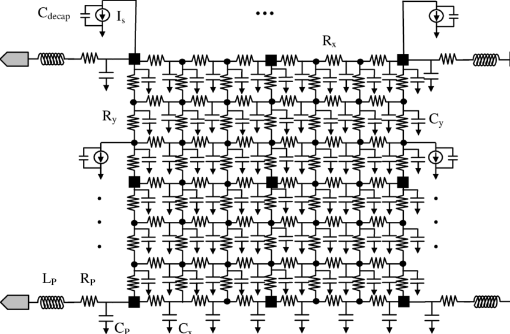

# EECS 251B Lab 5 - Power and Rail Analysis on a RocketChip 

<p align="center">
Profs: Bora Nikolic, Sophia Shao, Vladimir Stojanovic
</p>
<p align="center">
TA: Erik Anderson
</p>
<p align="center">
Department of Electrical Engineering and Computer Science
</p>
<p align="center">
College of Engineering, University of California, Berkeley
</p>

## Overview 
In prior labs, you increasingly dove deeper into the details of VLSI design,
all the way down to the custom design flow. In this lab, we will explore power
consumption using different analysis methodologies for a small RocketChip
configuration from Chipyard and also learn how to do and interpret IR drop
analysis.

## Getting Started

We will once again start with updating our environment. Pull the latest
changes to your local Chipyard repository.

```
cd chipyard
git pull
source scripts/inst-env.sh
```

Then, run the flow on the `TinyRocketConfig`. This will take a few hours
through elaboration/SRAM mapping (as seen in Lab 1), synthesis, and P&R. The
binary from Lab 1 is included for the extra ungraded portion. Be mindful of
compute resource utilization as well, since the tools will use bursts of 8 CPU
cores. Continue reading through the lab while everything is running.


```
cd vlsi
export CONFIG=TinyRocketConfig
export BINARY=$RISCV/riscv64-unknown-elf/share/riscv-tests/isa/rv64ui-p-simple
export INPUT_CONFS=lab5/ChipTop.yml
make par 
```

## Post-P&R Questions 
You can come back to answering these
questions after reading the next section and P&R finishes.

***Q1: What is the clock period and uncertainty? Does it meet timing post-P&R?
Are any of the SRAMs for the caches in the critical path? If not, where do they
rank in the list of longest paths?***

***Q2: Open up the final Innovus database with the `open_chip` script as
before. Turn off all the metal layers. Then, highlight all instances of
`DECAP*` cells, and submit a screenshot in your lab report. You will refer back
to this later. Note: you can do this through a command in the Innovus terminal
like `select_obj [get_db insts -if {.base_cell.name == DECAP*}]`***

***Q3: Now go to the "amoeba" view (purple blob icon on the top right).
Right-click the center of the floorplan (it highlights all instances belonging
to the `system` module) and select "Ungroup". Do this once more, then click off
the floorplan. Submit a screenshot of this, and then estimate what percent of
the core area (the floorplan excluding cache SRAMs) the tile
(`system/tile_prci_domain`) consumes.}*** 

***Q4: Determine the power strap widths and set-to-set spacing on layers M3
thru M9 (hint: these can be found in a source TCL file to P&R). Estimate the
the density of the straps on each layer and correlate this with the
`par.generate_power_straps_options.power_utilization` settings in
`inst-asap7.yml`. Note: this is a demonstration of Hammer's power straps
API.***

## Cadence Voltus: Power and Rail Analysis
Cadence Voltus in a nutshell is a tool that performs power and rail analysis on
your physical designs. Power analysis is pretty self-explanatory; rail analysis
uses the current consumption from power analysis and finds out how much voltage
is dropped over the power and ground power supply nets due to resistance in the
power grid (IR drop) and supply/ground bounce from switching events and
insufficient supply decoupling capacitance. An illustration of a real power
grid network is shown for one supply in Fig. 1, indicating how there are
wirebond resistances and inductances, supply grid resistances, and capacitances
with other supply nets (e.g. ground for a single-supply design like ours). The
flow we have can also analyze
[electromigration (EM)](https://en.wikipedia.org/wiki/Electromigration), which
is a wire failure phenomenon caused by current pushing metal atoms to/away from
where they were manufactured, but this requires EM limits specified by the
technology, which ASAP7 does not have.

There are also advanced tools such as power gating, package/through-silicon via
(TSV) analysis, "what-if" rail analysis, self-heating, body bias, and ESD
analysis that we will not explore in this lab. Refer to the Voltus user guide
at `/share/instsww/cadence/SSV181/doc/voltusUG/voltusUG.pdf` for everything it
can do. The following is a summary of the power and rail analysis flow
as implemented in Hammer:

- ***Power Grid Library Generation***: Done in the `init_technology` step, the
  technology standard cells and any macros have their power and ground supplies
  characterized for resistance, capacitance, etc. The characterization
  (depending on the fidelity) requires the wire parasitic information, Spice
  models, and geometry information (LEF, GDS) to run a brief set of
  simulations. These libraries are then used during rail analysis below. Note
  that the dummy ASAP7 SRAMs don't have geometry in them, so they won't have
  any libraries generated.  
- ***Design initialization***: The Innovus database is read in the
  `init_design` step. This database contains not only geometry information but
  also timing information across corners, which is used during dynamic analysis
  below.
- ***Static power analysis***: Done in the `static_power` step, this is a power
  calculation based on average switching power (1/2 &#945; C VDD^2 f as you
  have seen many times). An activity factor of 0.2 is assumed by default.  This
  is then summed with internal power (charging/discharging of interconnect and
  device capacitances internal to cells and characterized in LIBs) and leakage
  power (also from LIBs). 
- ***Static rail analysis***: Done in the `static_rail` step, this uses the
  average current numbers from static power analysis for each instance and uses
  it to calculate the IR drop on the power supply grid. There are many reports
  and pictures generated to help visualize where the worst IR drop regions are.
- ***Dynamic power analysis***: Done in the `active_rail` step, this is
  a more detailed power calculation based on probabilities of switching events
  on all nodes as calculated from a timing database (vectorless) and actual
  logic switching waveforms from simulation (vector-driven). In our case, our
  simulation waveform is from the simulation on the RISCV binary post-P&R.
- ***Dynamic rail analysis***: Done in the `active_rail` step, this takes the
  current information from dynamic power analysis and provides a more detailed
  picture of IR drop. If simulation waveforms or activity files don't exist, it
  will only analyze the vectorless power characterization.

<p align="center">
 
    <br><em>Fig. 1 - RLD model of supply grid network</em></br>
</p>

## Running Power Analysis

We will manually run power analysis from the end of P&R because the default
`power-par` Make target expects a post-P&R simulation before running
post-P&R power analysis: 

```
./example-vlsi par-to-power -e inst-env.yml \
  -p build/chipyard.TestHarness.TinyRocketConfig-ChipTop/par-rundir/par-output-full.json \ 
  -o build/chipyard.TestHarness.TinyRocketConfig-ChipTop/power-input.json \
  --obj_dir build/chipyard.TestHarness.TinyRocketConfig-ChipTop

./example-vlsi power -e inst-env.yml \
  -p build/chipyard.TestHarness.TinyRocketConfig-ChipTop/power-input.json \
  --obj_dir build/chipyard.TestHarness.TinyRocketConfig-ChipTop
```

## Post-Power Analysis Questions

***Q5: In your lab report, draw a very simplified model of an inverter being
supplied by a power and ground network with finite resistance.  Then, draw a
series of waveforms showing what the voltage on the power and ground nets of
the inverter would look like driven by a clock signal, with and without
additional decoupling capacitance. These waveforms should be qualitative--no
numbers required.*** 

Drawings to submit:
- Circuit model (label decaps) 
- Input clock waveform
- Output waveform 
- Current draw from VDD 
- Current sinking to VSS
- VDD voltage w/o decap 
- VDD voltage w/ decap 
- VSS voltage w/o decap 
- VSS voltage w/ decap

***Q6: Concisely describe how IR drop and ground bounce as you have drawn above
can affect the following: gate delay/setup/hold times, setup time margin, and
hold time margin. Make sure to note all of the physical circuit changes that
affect these parameters and include diagrams where helpful.***

***Q7: As you observed in the P&R database, the power straps on the lower
layers have VDD and VSS paired together. What is the benefit of doing this for
a supply grid as opposed to having VDD and VSS straps at equidistant intervals
across the design?***

Now, let's dig through the reports from power and rail analysis in our
`power-rundir`. For simplicity, let's examine everything for the setup corner.
Static power results are in the folder `staticPowerReports.<corner>` and static
rail results are in `staticRailReports/ALL_100C_avg_<num>` where `<num>` is the
highest number. Dynamic vectorless power results are in
`activePowerReports.<corner>`, and dynamic vectorless rail results are in
`activeRailReports/ALL_100C_dynamic_<num>` where `<num>` is the highest number.
If you did post-P&R simulation (see next section), the dynamic vector-based
results are in similar folders appended by the generated SAIF file.

***Q8: Compare the `power.rpt` files between the static and vectorless dynamic
power analysis. Which one is higher? What does this say about the switching
probabilities of this design as compared to the default activity factor?***

***Q9: Open the vectorless dynamic rail analysis log (`voltus_rail.log`) and
scroll down to the IR Drop (Linear) section. In your report, copy the generated
report with the IR drop ranges and drop per layer, and attach the generated GIF
image. How does the location of the core logic and power pins support the shape
of the voltage contours? Which region in the floorplan suffers the highest IR
drop?***

***Q10: Now, go to the Effective Instance Voltage section. In your report,
attach the generated GIF image (`VDD_VSS.worst_eiv.gif`, not
`VDD_VSS.worst_limit_eiv.gif`). Then open up the actual instance voltage file,
which lists all the instances and their voltages. Do these seem to correlate
with the floorplan region you determined above? Can you make any determination
as to whether the IR drop here may cause a degradation in our maximum
achievable clock frequency in this corner?***

***Q11: Note that the DECAP cells in ASAP7 are not characterized
at all. However, the standard cells have a limited but lower amount of
intrinsic decapacitance (why is this?). Based on the highlighted locations of
the decap cells, would they help improve the instance voltages much if their
capacitance was characterized properly? How would the leakage power change if
the decap cells' power was also characterized properly?***

***Q12: Enumerate things you can change (as many as you can come up with!) to
preserve the amount of IR drop if the power strap density had to be cut in
half. Hint: think floorplan, clocks, etc.***

## Extra Credit

In the interest of time, vector-based dynamic power/rail analysis is excluded
above. If you would like to try to analyze the power of the `rv64ui-p-simple`
benchmark, you should change to a slower clock period (e.g. 1ns+) to ensure
that the design passes timing. Then, do:

```
make power-par
```

This will also run a post-P&R simulation of the binary followed by power/rail
analysis. Note that the simulation may take a long time -- it may even timeout
if P&R was not clean. But, the vector-based dynamic power analysis should still
work. Then, answer these questions if you wish:

***Q13: Compare the vectorless and vector-based power as well as the IR drop
report and figures. How does the benchmark's overall switching power compare to
the vectorless assumption?***

***Q14: Look at the vector-based IR drop report/picture. Are there any
"hotspots"? Can you correlate this with any particular module that you saw in
the amoeba view in Innovus?***

## Conclusion

This lab was meant to give you a glimpse into how power consumption can be
calculated to varying levels of accuracy, then introduce some of the impacts of
this power consumption in a physical design. The most prominent, IR drop and
ground bounce, informs the power grid network design in order for you to hit
your performance targets when you get the silicon back. Other effects not
analyzed in this lab such as electromigration and self-heating have the
potential to drastically reduce the reliability and longevity of your chip,
which is very important for certain applications.

Finally, Voltus has the ability to analyze various scenarios that we
conceptually explored in the lab questions, such as a "what-if" analysis of
what would happen if we changed the power grid, or integration with Tempus, the
static timing analysis tool, to simulate the effect of calculated IR drops on
the resulting delay, clock skew, jitter, and critical path. These are left for
you to explore in your projects and/or future research.

## Acknowledgements
This is an updated version of a Spring 21 EE241B Lab written by Harrison Liew. 
